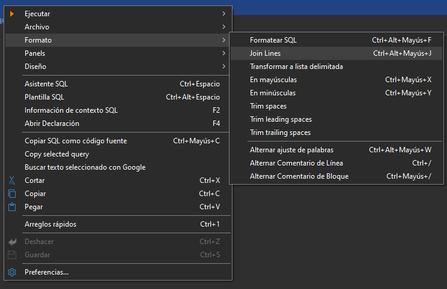

# DBeaver Join Lines

[](https://github.com/jabaruben/dbeaver-join-lines/actions/workflows/validate.yml)
[](https://github.com/jabaruben/dbeaver-join-lines/releases/latest)
[](LICENSE)

Adds Eclipse's native **Join Lines** command to the **Format** submenu of the DBeaver SQL editor context menu.

This project does not reimplement the editor action. It exposes the native Eclipse command:

```text
org.eclipse.ui.edit.text.join.lines
```

inside DBeaver's dynamically created `Format` context submenu.

## Screenshot



> The keyboard shortcut shown in the screenshot is user-configured. The plugin itself does not define or override a shortcut.

## Why?

DBeaver includes the underlying Eclipse `Join Lines` command, but it is not exposed in the SQL editor's **Format** context menu by default.

This small plugin adds it there, directly below **Format SQL**.

## Installation

### Recommended: GitHub Release

Download the latest `DBeaverJoinLines-x.y.z-portable.zip` from the [Releases](https://github.com/jabaruben/dbeaver-join-lines/releases) page.

Then:

1. Extract the ZIP.
2. Close DBeaver completely.
3. Open PowerShell in the extracted directory.
4. Run:

```powershell
powershell -ExecutionPolicy Bypass -File .\install.ps1
```

If DBeaver is installed in a custom location:

```powershell
powershell -ExecutionPolicy Bypass -File .\install.ps1 -DBeaverHome "C:\Path\To\DBeaver"
```

After installation:

```text
SQL editor
└── Right click
    └── Format
        ├── Format SQL
        └── Join Lines
```

The extracted installer folder can be deleted after a successful installation.

### Uninstall

The plugin can be removed directly from DBeaver:

```text
Help
→ About DBeaver
→ Installation Details
→ Installed Software
→ DBeaver Join Lines
→ Uninstall
```

or with the included script:

```powershell
powershell -ExecutionPolicy Bypass -File .\uninstall.ps1
```

## Keyboard shortcut

The plugin does not define or override a keyboard shortcut.

Eclipse/DBeaver may already associate a shortcut with `Join Lines`. You can customize it in:

```text
Window
→ Preferences
→ User Interface
→ Keys
```

Search for `Join Lines`.

## Build

Requirements:

- Windows PowerShell
- A local DBeaver installation containing Eclipse p2 publisher/director components
- DBeaver closed during the build

Run:

```powershell
powershell -ExecutionPolicy Bypass -File .\build.ps1
```

If DBeaver is not automatically detected:

```powershell
powershell -ExecutionPolicy Bypass -File .\build.ps1 -DBeaverHome "C:\Path\To\DBeaver"
```

To build a specific semantic version:

```powershell
powershell -ExecutionPolicy Bypass -File .\build.ps1 -Version 1.0.1
```

The build script injects that version into the generated bundle, feature and p2 metadata without modifying the source files.

The distributable package is created under:

```text
dist\DBeaverJoinLines-1.0.1-portable.zip
```

## Releases

Releases are automated with GitHub Actions.

Create and push a semantic version tag:

```powershell
git tag v1.0.0
git push origin v1.0.0
```

The release workflow will:

1. derive `1.0.0` from the `v1.0.0` tag;
2. download a compatible DBeaver Community build containing Eclipse p2;
3. build the versioned plugin and portable p2 repository;
4. create a GitHub Release;
5. attach `DBeaverJoinLines-1.0.0-portable.zip` to the release.

## How it works

The plugin contributes the existing Eclipse command:

```text
org.eclipse.ui.edit.text.join.lines
```

to DBeaver's SQL editor submenu, immediately after DBeaver's `ContentFormatProposal` action:

```text
popup:format?after=ContentFormatProposal
```

The plugin is packaged as an Eclipse feature and published as a local p2 repository. The portable installer uses the Eclipse p2 Director bundled with DBeaver.

## Contributing

Contributions are welcome. Please read [CONTRIBUTING.md](CONTRIBUTING.md) before opening a pull request.

For bugs and feature requests, use the repository's issue templates.

## Project structure

```text
.
├── .github/
│   ├── ISSUE_TEMPLATE/
│   ├── pull_request_template.md
│   └── workflows/
│       ├── validate.yml
│       └── release.yml
├── docs/
│   └── dbeaver-join-lines.png
├── plugin/
│   ├── plugin.xml
│   └── META-INF/
│       └── MANIFEST.MF
├── feature/
│   └── feature.xml
├── category.xml
├── build.ps1
├── install.ps1
├── uninstall.ps1
├── README-INSTALL.txt
├── CHANGELOG.md
├── CONTRIBUTING.md
├── LICENSE
└── .gitignore
```

## Compatibility

Developed and verified with DBeaver Community **26.1.5** on Windows.

Because the plugin relies on Eclipse UI command IDs and DBeaver's `format` menu contribution ID, future DBeaver releases could require an update if those internals change.

## Author

**Ruben Carracedo**  
GitHub: [@jabaruben](https://github.com/jabaruben)

## License

MIT License — Copyright © 2026 Ruben Carracedo.

DBeaver and Eclipse are trademarks of their respective owners. This project is an independent community extension and is not affiliated with or endorsed by DBeaver Corp. or the Eclipse Foundation.
